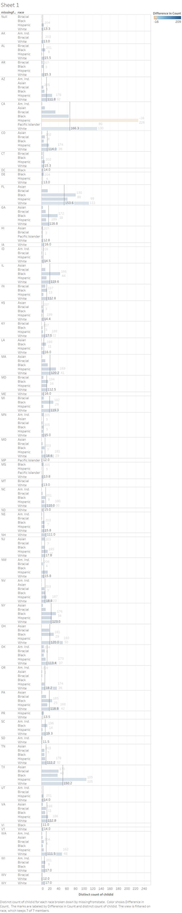
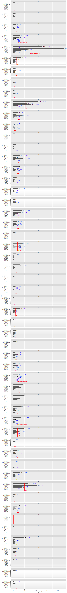
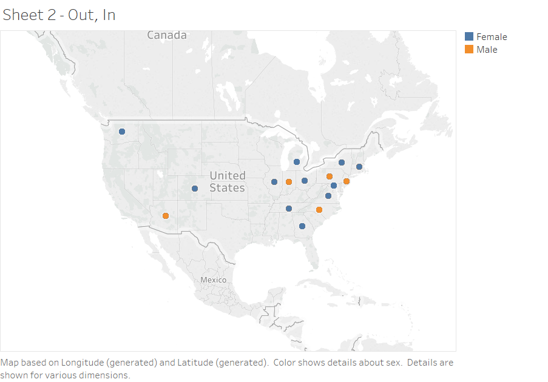
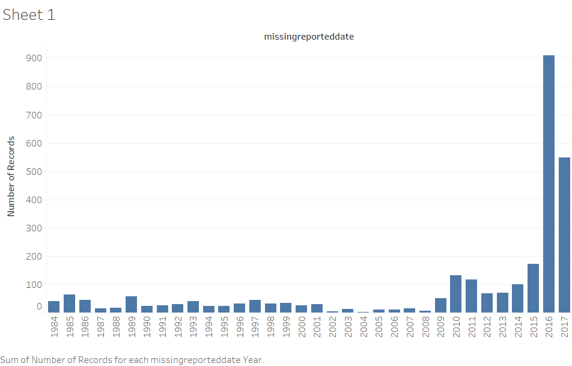
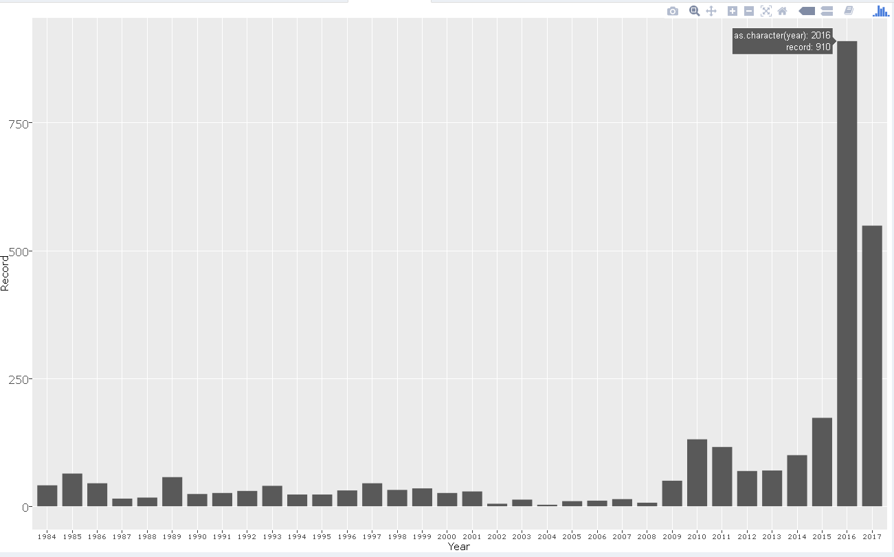

<center></center>

# **INTRODUCTION**
Each year, thousands of children are reported missing, an issue prevalent across the United States. Typically, the words "missing child" are associated with crimes of kidnapping and murder. However, a child can be reported missing for a variety of reasons. It is important to understand these reasons in order to better address the issue at hand. For our final project, we used data about reported missing children to create interesting visualizations in Tableau and R. 

#**SESSION INFORMATION**
Below we display our sessionInfo().

```{r sessionInfo}

sessionInfo(package=NULL)
```

# **DATA SOURCE**
We obtained our data from _______.

# **ETL**
In order to better create and format the data regarding missing children, we built a ETL script to clean-up the data. This involved separating the data into measures and dimensions as the clean-up varied depending on its content. For the dimensions, we removed any hyphens, changed the & symbol to the word "and," and replaced any NULL values with an empty string. As for the measures, we removed any non-numeric or numerically associated values. We kept numbers, the letter e for scientific notation, and any periods for decimals. The measures were then set as numeric values. This file was then written to a new csv file.

The ETL script can be seen below: 
```{r warning=FALSE}
source("../01 Data/R_ETL_Final.R")
```

# **THE DATA**
These graphs show some of the interesting findings found in this data.

## **Figure 1**
<center>  </center>

## **Figure 2**
<center>  </center>

Figure 1 and 2 shows a barchart of the race of missing children vs. the count of children missing, specifically in each state. The black line shows the average number of children missing in each state across all races. Additionally, there is a table calculation within this barchart The Average Count of Children per Race - count of Children per Race is calculated and indicated on the barchart. An interesting thing to note for this barchart is the fact that white children are more likely to go missing in each state. Additionally, typically Asian childrens are one of the least likely to go missing in each state. Figure 1 was created in Tableau while Figure 2 was created using Shiny.

## **Figure 3**

<center>  </center>


## **Figure 4**

<center>  </center>

Figure 3 and Figure 4 show a geographic fields map based on longitude and latitude. The color on the map differentiates between whether females or males are the sex of the majority of the children that have gone missing. A set was made from a barchart of missingfromstate vs. the sum of people with bachelor's degrees in each state. This data was created by joining the MediaReadyActiveCases with the Education data from the US Census Data. This set consists of the "Medium" group with bachelor's degrees. This set was then plotted on the map. For the two figures, the type of case was also included in a popup upon hovering over the location. Something to notice is that the majority of this set comes from the east side of the United States. Additionally, these cases are typically endangered runaway cases. Figure 3 was created via Tableau while Figure 4 was created using Shiny. 

## **Figure 5**

<center>  </center>

## **Figure 6**

<center>  </center>


Figure 5 and Figure 6 show the number of children that have gone missing versus the year upon which they are reported missing. An interesting thing to note is that in the last two years, specifically 2016 and 2017, the number of children reported missing has increased substantially. It was not until the year of 2010, that the number of missing children reported began to exceed 100 cases. In less than 10 years, the number has shot up exponentially to over 900 cases. FIgure 5 was created using Tableau while Figure 6 was created using Shiny. 

Figure 2, 4, and 6 has been published to the following shiny.ios app: https://carolhuang0502.shinyapps.io/project6/


#  **Source Code**

## **Figure 2, 4, and 6 Source Code**
```{r}
source("../02 Shiny/server.R")
```

```{r}
source("../02 Shiny/ui.R")
```


# **Knit R-markdown into HTML file**
library(knitr)
f = system.file