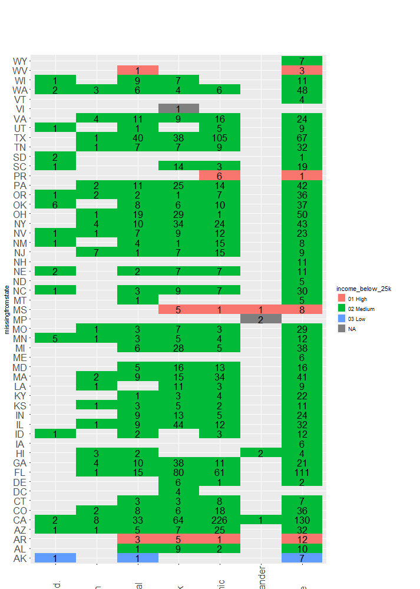

<center></center>

# **INTRODUCTION**
Each year, thousands of children are reported missing, an issue prevalent across the United States. Typically, the words "missing child" are associated with crimes of kidnapping and murder. However, a child can be reported missing for a variety of reasons. It is important to understand these reasons in order to better address the issue at hand. For our final project, we used data about reported missing children to create interesting visualizations in Tableau and R. 

#**SESSION INFORMATION**
Below we display our sessionInfo().

```{r sessionInfo}

sessionInfo(package=NULL)
```

# **DATA SOURCE**
We obtained our data from data.world. Specifically from a user by the name of jamesgray, the data set missing-children-in-the-us was downloaded as our dataset. This data was extracted from The National Center for Missing and Exploited Children (NCMEC). It was released as part of the Cloudera Child Finder Hackathon to develop new methods for finding missing children. The dataset can be found [here](https://data.world/jamesgray/missing-children-in-the-us).

# **ETL**
In order to better create and format the data regarding missing children, we built a ETL script to clean-up the data. The source code can be seen below.


```{r warning=FALSE}
source("../01 Data/R_ETL_Final.R")
```


For the ETL script, the first step involved separating the data into measures and dimensions as the clean-up varied depending on its content. Dimensiona are non-numeric values while measures are numeric values. For the dimensions, we removed any hyphens, changed the & symbol to the word "and" and replaced any NULL values with an empty string. Hyphens were removed more for aesthetics. Similarly, changing the & symbol to the word "and" was also another aesthetic item. In contrast, replacing any NULL values with an empty string allowed for better processing of the data. NULL exists for values that are unknown in the data; however, the presence of a NULL causes analysis to be more difficult to do. By removing these and simply replacing them with an empty string, the data is able to be analyzed with ease. As for the measures, we removed any non-numeric or numerically associated values. We kept numbers, the letter e for scientific notation, and any periods for decimals. The presence of non-numeric values or numerically related values will result in an error when attempting to make visualizations using the data. The measures were then set as numeric values. This file was then written to a new csv file. The ETL script code is displayed below. 

```{r, code = readLines("../01 Data/R_ETL_Final.R"), eval=FALSE}
source('../01 Data/ETL.R')
```

# **THE DATA**
These graphs show some of the interesting findings found in this data.

## **Box Plots**

### **Figure 1: Visualization 1 - Tableau Visualization**
<center>  </center>


### **Figure 2: Visualization 1 - Shiny Visualization**
<center>  </center>


Figure 1  and Figure 2 show a box plot of the different races with the data summarized based on weight. Each box plot includes the 5 number summary: minimum, first quartile, median, third quartile, and maximum. They are filtered by weight and missing from date.

An interesting thing to note from the box plots is clicking through the states, some states do not have reported missing children of certain race. However, the white children are almost always shown in the box plots. For many of them, the box plot for white children has the largest distribution between minimum and maximum. 

## **Histograms**

### **Figure 3: Visualization 2 - Tableau Visualization**
<center>  </center>


### **Figure 4: Visualization 2 - Shiny Visualization**
<center>  </center>


Figure 3 and Figure 4 show a histogram of the number of recorded missing children in 10 year increments with regards to the missing from date. 

An interesting thing to note from the histogram is that for the most part, the number of children that have gone missing has increased over the years. An abnormal point in time is in the 2000's. The number of missing children decreases and breaks the trend. However in the 2010's the number spikes and increases exponentially.

### **Figure 5: Visualization 3 - Tableau Visualization**
<center>  </center>


### **Figure 6: Visualization 3 - Shiny Visualization**
<center>  </center>


Figure 5 and Figure 6 show a histogram of the number of recorded missing children separated based on their height (for the Tableau visualization) and weight (for the Shiny visualization). It is further divided by race as each race is represented by a different color on the histogram as seen in the legend. 

An interesting thing to note from the histogram is that similar to the box plots, the color for white children is substantially larger than those for other races. However, looking at this specific visualization, one is able to see that although white children are most likely to go missing, Hispanic children fall in close 2nd. 

## **Scatterplots**

### **Figure 7: Visualization 4 - Tableau Visualization**
<center>  </center>


### **Figure 8: Visualization 4 - Shiny Visualization**
<center>  </center>


Figure 7 and 8 shows a scatterplot that compares missing children weight (x-axis) versus height (y-axis) colored by gender. 

This plot is interesting because the of the regression line that is placed on each gender; the female regression line is significantly less steep than the male, suggesting that the average missing female is predicted to have a higher weight/height ratio than the average missing male.


## **Crosstabs**

### **Figure 9: Visualization 5 - Tableau Visualization**
<center>  </center>


### **Figure 10: Visualization 5 - Shiny Visualization**
<center>  </center>


Figure 9 and 10 shows a crosstab of state vs. race of missing children. It is filtered given the parameter that the income for household is less than 25K. It is then separated between Low, Medium, and High which is defined as number of household with income level from 0k-25k over the total number of households. Using the MediaReadyActiveCases and US Census data, specifically the income data, Figure 1 was produced via Tableau while Figure 2 was produced using Shiny. 

An interesting thing to note is that the majority of the childrens that go missing are from the middle range income. This is apparent across the majority of the states.  


## **Barcharts**

### **Figure 11: Visualization 6 - Tableau Visualization**
<center>  </center>


### **Figure 12: Visualization 6 - Shiny Visualization**
<center>  </center>

Figure 11 and 12 shows a barchart of the race of missing children vs. the count of children missing, specifically in each state. The black line shows the average number of children missing in each state across all races. Additionally, there is a table calculation within this barchart The Average Count of Children per Race - count of Children per Race is calculated and indicated on the barchart. 

An interesting thing to note for this barchart is the fact that white children are more likely to go missing in each state. Additionally, typically Asian childrens are one of the least likely to go missing in each state. Figure 1 was created in Tableau while Figure 2 was created using Shiny.

### **Figure 13: Visualization 7 - Tableau Visualization**
<center>  </center>


### **Figure 14: Visualization 7 - Shiny Visualization**
<center>  </center>


Figure 13 and 14 show a geographic fields map based on longitude and latitude. The color on the map differentiates between whether females or males are the sex of the majority of the children that have gone missing. A set was made from a barchart of missingfromstate vs. the sum of people with bachelor's degrees in each state. This data was created by joining the MediaReadyActiveCases with the Education data from the US Census Data. This set consists of the "Medium" group with bachelor's degrees. This set was then plotted on the map. For the two figures, the type of case was also included in a popup upon hovering over the location. 

Something to notice is that the majority of this set comes from the east side of the United States. Additionally, these cases are typically endangered runaway cases. Figure 3 was created via Tableau while Figure 4 was created using Shiny.

Figures 2, 4, 6, 8, 10, 12, and 14 has been published to the following shiny.ios app: https://carolhuang0502.shinyapps.io/finalproject/


#  **Source Code**

## **Shiny server.R and ui.R Source Code**
```{r}
source("../02 Shiny/server.R")
```

```{r}
source("../02 Shiny/ui.R")
```

## **Shiny server.R Code**
```{r, code = readLines("../02 Shiny/server.R"), eval=FALSE}
source('../02 Shiny/server.R')
```


## **Shiny ui.R Code**
```{r, code = readLines("../02 Shiny/ui.R"), eval=FALSE}
source('../02 Shiny/ui.R')
```
# **Knit R-markdown into HTML file**
library(knitr)
f = system.file